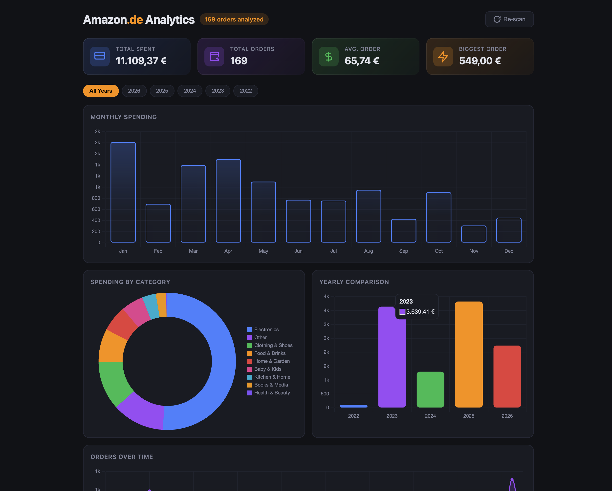

# Amazon Analytics Extension

A Chrome extension that analyzes your Amazon purchase history and generates beautiful, interactive analytics — with zero manual effort.

Supports **Amazon.de** (EUR), **Amazon.in** (INR), and **Amazon.com** (USD).




## Features

- **One-click analysis** — Click the floating button on any Amazon page and your entire order history is scanned automatically
- **Multi-region support** — Works on Amazon.de, Amazon.in, and Amazon.com with correct currency formatting
- **Interactive dashboard** — Opens in a new tab with full-page charts and insights
- **No data leaves your browser** — Everything runs locally, nothing is sent to any server

### Dashboard includes

- **Summary cards** — Total spent, total orders, average order value, biggest order
- **Monthly spending** bar chart
- **Category breakdown** doughnut chart (auto-categorizes orders into Electronics, Books, Clothing, etc.)
- **Yearly comparison** bar chart
- **Spending timeline** line chart across all months
- **Key insights** — Busiest month, average spend per month, order frequency, top category, spending trend, peak spending day
- **Top 10 most expensive orders** list
- **Year filter** — Drill into specific years

## Installation

1. Clone this repository
   ```bash
   git clone git@github.com:arshadkazmi42/amazon-analytics-extension.git
   ```
2. Open `chrome://extensions/` in Chrome
3. Enable **Developer mode** (top right toggle)
4. Click **Load unpacked** and select the cloned folder

## Usage

1. Go to any Amazon page (amazon.de, amazon.in, or amazon.com) and make sure you're logged in
2. Click the orange floating analytics button in the bottom-right corner
3. Wait for the scan to complete (progress shown on the button)
4. The analytics dashboard opens automatically in a new tab

### Re-scanning

- Click the **Re-scan** button on the dashboard to fetch fresh data
- Each Amazon domain's data is cached separately for 1 hour

## How it works

Amazon encrypts order data client-side, so the extension loads order pages in hidden iframes within the same origin to access the rendered (decrypted) DOM. It then extracts dates, prices, order numbers, and item names from the live page content.

## Tech Stack

- Chrome Extension Manifest V3
- Vanilla JavaScript (no frameworks)
- [Chart.js](https://www.chartjs.org/) for visualizations

## Privacy

All data processing happens entirely in your browser. No data is collected, transmitted, or stored externally. Order data is cached locally in Chrome's extension storage and is never shared.

## License

MIT
